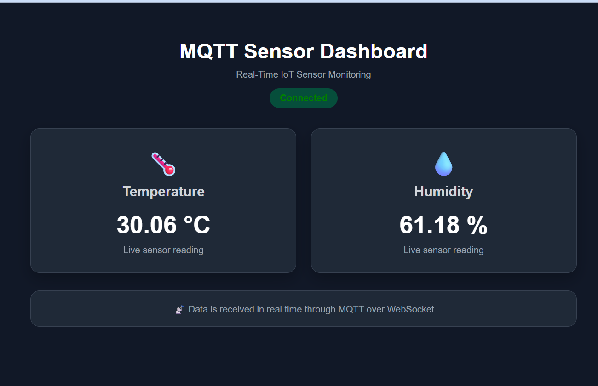
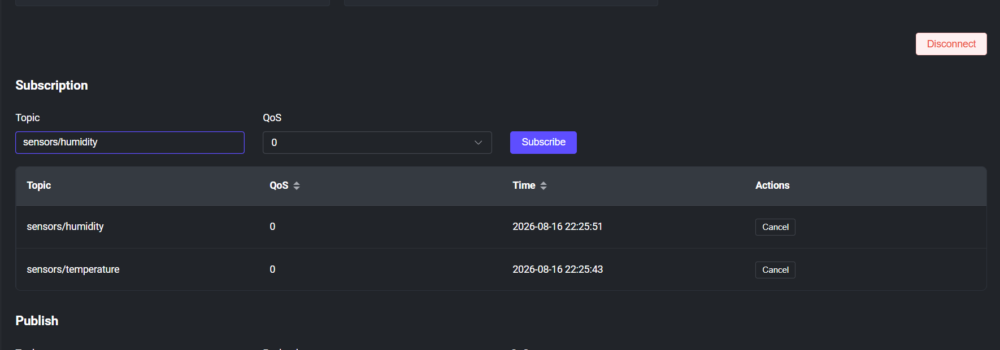
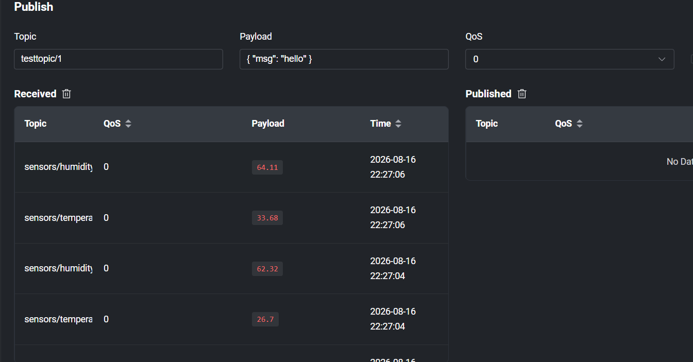

# MQTT EMQX Sensor Dashboard

A real-time IoT sensor dashboard built using Python, MQTT, EMQX, MQTT over WebSocket, HTML, and JavaScript.

The project continuously generates temperature and humidity sensor values using Python, publishes them to an EMQX MQTT broker, and displays the received values live on a web dashboard.

## Project Architecture

```text
Python Sensor Publisher
        |
        | MQTT Publish
        v
   EMQX MQTT Broker
        |
        | MQTT over WebSocket
        v
     Web Browser
        |
        v
      app.js
        |
        v
    index.html
        |
        v
Live Temperature & Humidity Dashboard
## Screenshots

### Live MQTT Sensor Dashboard



The dashboard displays live temperature and humidity values received through MQTT over WebSocket.

### EMQX WebSocket Client



The EMQX WebSocket client is subscribed to the temperature and humidity MQTT topics.

### Live Sensor Messages



The EMQX client receives continuously changing temperature and humidity values published by the Python sensor publisher.
